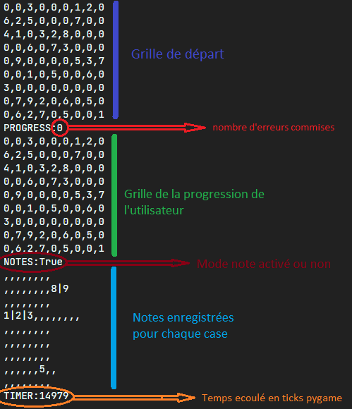

# Projet Sudoku

Application permettant de joueur au jeu du Sudoku réalisée en Python.
#### Auteurs :
- VIEIRA Ruben
- LENROUÉ Axel

## Fonctionnalités
- Lecture et écriture de grilles dans le format .sudoku spécialement imaginé pour ce projet
- Génération aléatoire de grilles pour une taille choisie (4x4, 9x9 ou 16x16) et un niveau choisi (Facile, Moyen, Difficile, Expert ou Diabolique)
- Résolution de grilles avec un algorithme de résolution utilisant le backtracking et optimisé pour le jeu du Sudoku
- Interface utilisateur permettant de jouer au Sudoku avec les grilles enregistrées

## Format .sudoku
Ce format de fichier texte est reconnu par le programme et permet de sauvegarder une grille de Sudoku, mais aussi toutes les informations nécessaires pour reprendre une partie interrompue de Sudoku.
  
